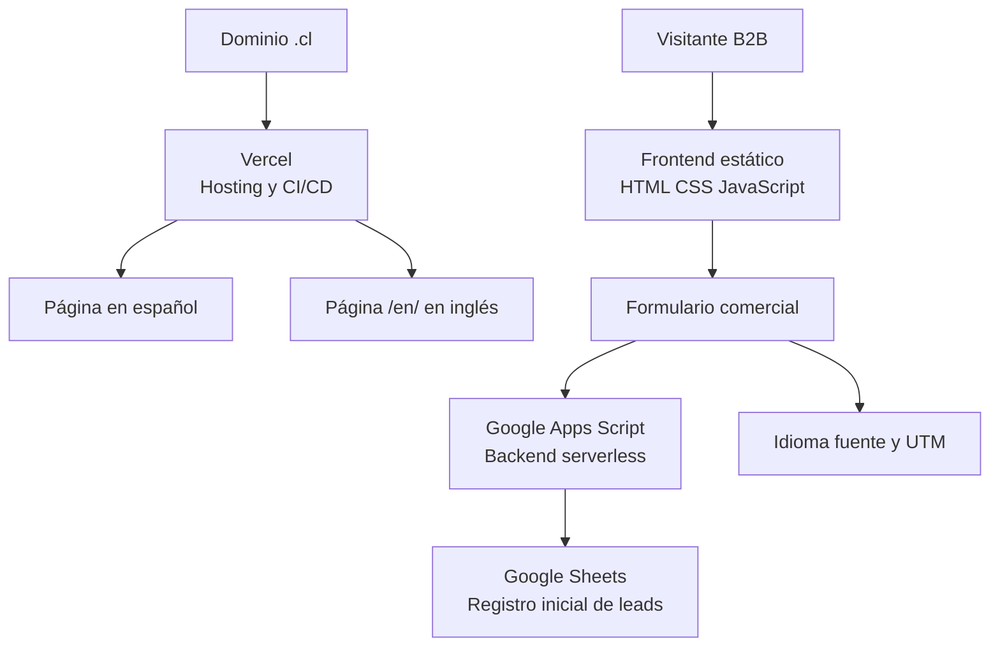

# Caso de éxito técnico — Plataforma web B2B industrial bilingüe

> **Confidencialidad:** este documento anonimiza al cliente y omite marca, dominio, personas, contactos, URLs privadas, endpoints, identificadores, registros DNS, capturas y datos comerciales confidenciales.

## Resumen

Se diseñó y llevó a producción una plataforma web B2B para una **empresa industrial chilena especializada en productos químicos y soluciones técnicas para la industria del cuero, con relaciones comerciales internacionales**.

El proyecto resolvió una necesidad que iba más allá de una landing: habilitar una presencia comercial bilingüe, una captación de prospectos trazable, SEO internacional, preparación para búsqueda asistida por IA y una operación simple sin backend tradicional.

## Resultado

- Sitio responsive en español e inglés con páginas físicas independientes.
- Captación comercial operativa con registro estructurado de leads.
- Tracking de idioma, fuente y campañas UTM.
- SEO internacional y datos estructurados configurados.
- Preparación GEO / AI Search mediante contenido semántico, FAQ y `llms.txt`.
- Reducción aproximada del **82%** del peso de las imágenes principales.
- Despliegue continuo, bajo costo operativo y sin infraestructura backend dedicada.

## El desafío

La solución debía atender público local e internacional, presentar una oferta técnica B2B de forma clara y convertir visitas en consultas comerciales con contexto suficiente para seguimiento.

Además, el sitio existente debía continuar disponible mientras se desarrollaba y validaba la nueva versión. La arquitectura debía ser mantenible por un equipo pequeño, evitar costos de servidores tradicionales y ofrecer una base sólida para marketing, QR y campañas futuras.

## Objetivos de solución

### Funcionales

- Publicar contenido comercial en español e inglés.
- Capturar nombre, empresa, ubicación, teléfono, correo, interés y mensaje.
- Registrar consentimiento, idioma, fuente y parámetros UTM.
- Centralizar los leads iniciales para su gestión comercial.

### No funcionales

- Lograr SEO internacional técnicamente correcto.
- Priorizar rendimiento y experiencia móvil.
- Mantener una arquitectura simple y de bajo costo.
- Desplegar cambios de manera controlada y reversible.
- Evitar indexación de entornos no productivos.

## Arquitectura



| Capa | Tecnología | Responsabilidad |
|---|---|---|
| Frontend | HTML, CSS, JavaScript vanilla | Experiencia B2B, contenidos, formulario y medición |
| Versionamiento | Git y GitHub | Historial de cambios, revisión y fuente de despliegue |
| Hosting / CI-CD | Vercel | Hosting estático y promoción automatizada de cambios |
| Dominio | Dominio `.cl` con DNS delegado al hosting | Resolución del sitio productivo |
| Captación | Google Apps Script | Recepción serverless de los datos de formulario |
| Registro inicial | Google Sheets | Persistencia liviana y revisable de leads |

## Decisiones de arquitectura

| Decisión | Por qué | Beneficio obtenido |
|---|---|---|
| HTML, CSS y JavaScript vanilla | El alcance era principalmente informativo y comercial | Menos dependencias, carga rápida y mantención directa |
| Páginas físicas para ES y EN | La traducción dinámica introducía inconsistencias en el formulario | Datos correctos por idioma y SEO internacional más robusto |
| Vercel conectado a GitHub | Se necesitaba una operación simple con despliegues confiables | CI/CD, rollback a través de Git y menor carga operativa |
| Apps Script + Sheets | La captación no justificaba un backend completo | Implementación rápida, sin servidor dedicado y costo acotado |
| Captura UTM | Era necesario atribuir consultas a campañas, QR y fuentes | Mejor lectura comercial de la adquisición |
| WebP con fallback JPG | Los recursos visuales iniciales eran pesados | Mejor rendimiento sin sacrificar compatibilidad |

## Internacionalización y SEO técnico

La arquitectura final utiliza una página principal en español y una página física independiente en `/en/`. Cada versión mantiene su propio contenido, etiquetas y contexto de conversión.

- `hreflang` configurado para `es`, `en` y `x-default`.
- Canonical independiente por idioma.
- Titles y meta descriptions adaptados a cada mercado.
- `robots.txt` y `sitemap.xml` para orientar el rastreo.
- Registro de sitemap y solicitud manual de rastreo de ambas versiones.
- Separación explícita entre producción y staging para evitar contenido duplicado o prematuro en buscadores.

## Captación, automatización y medición

El formulario fue diseñado como un punto de entrada comercial, no solo como un elemento de contacto. El flujo registra información de la oportunidad y su procedencia para facilitar priorización y seguimiento.

Campos enviados de manera anonimizada:

```text
timestamp
idioma
nombre
empresa
país/ciudad
teléfono
email
área de interés
mensaje
consentimiento
source
utm_source
utm_medium
utm_campaign
```

La capa serverless procesa el envío y registra los datos en una hoja de cálculo como almacenamiento inicial. Esta decisión deja una base preparada para futuras integraciones con CRM, automatizaciones de seguimiento o dashboards comerciales, sin elevar la complejidad inicial.

## SEO semántico y GEO / AI Search

La implementación consideró que la visibilidad no depende únicamente de palabras clave. El sitio explicita industria, capacidades y problemas que ayuda a resolver, para que buscadores y sistemas de IA puedan comprender mejor la propuesta.

- Contenido semántico explícito y orientado a intención B2B.
- JSON-LD de `Organization`, `WebSite`, `ContactPoint` y `FAQPage`.
- Uso de `knowsAbout` para reforzar el contexto técnico-sectorial.
- Preguntas frecuentes estructuradas.
- Archivo `llms.txt` como guía de lectura para sistemas de IA.

## Performance y experiencia

Los activos visuales principales se optimizaron de JPG a WebP, con una reducción aproximada del **82%** en su peso. Se conservaron versiones JPG como fallback de compatibilidad.

- Preload del recurso principal del hero.
- Atributos `width` y `height` para reducir desplazamientos de layout (CLS).
- Lazy loading para recursos no críticos.
- Diseño responsive para consultas y navegación móvil.

## Problemas encontrados y resolución

| Problema | Riesgo | Solución aplicada | Impacto |
|---|---|---|---|
| Landing bilingüe controlada por JavaScript | Valores ingleses podían registrarse como español | Migración a páginas físicas ES y EN | Datos coherentes, mejor SEO y mantenimiento más claro |
| Desarrollo con sitio activo | Riesgo de afectar la operación productiva | Staging controlado dentro del mismo proyecto | Validación sin interrumpir el sitio existente |
| Necesidad de captar leads sin backend tradicional | Mayor costo y tiempo de implementación | Google Apps Script + Google Sheets | Flujo serverless económico y suficiente para la etapa inicial |
| Falta de atribución de campañas | Leads sin fuente identificable | Captura de `source` y UTM | Lectura comercial de QR, campañas y referidos |
| Recursos visuales pesados | Carga lenta, especialmente en móvil | WebP, fallback JPG y estrategia de carga | Menor transferencia de datos y mejor experiencia |
| QR de pruebas y producción | Material definitivo podía dirigir a staging | QR separados por entorno | Control de activos impresos y digitales |
| Riesgo de indexación no deseada | Duplicidad o exposición de versión no aprobada | `noindex`, `nofollow`, robots, sitemap y canonical | Separación clara de entornos |
| Dominio y DNS en proveedores distintos | Confusión sobre dónde validar servicios externos | Validación TXT en el proveedor DNS efectivo | Verificación resuelta sin alterar la arquitectura |

## Despliegue y operación

1. Se creó un entorno de staging dentro del proyecto y se marcó con `noindex, nofollow`.
2. La nueva versión fue validada funcional y visualmente sin reemplazar la página productiva.
3. Antes del cambio se respaldó la versión anterior del sitio.
4. Tras la aprobación, los archivos se promovieron a producción mediante el flujo GitHub + Vercel.
5. El staging quedó excluido de indexación para preservar la higiene SEO.

## Capacidades demostradas

- Arquitectura de soluciones web B2B.
- Desarrollo frontend eficiente y sin dependencias innecesarias.
- Integración serverless y automatización de captación.
- Diseño de flujo comercial y trazabilidad de leads.
- SEO técnico, SEO internacional y GEO / AI Search.
- Optimización de rendimiento web.
- Versionamiento, CI/CD, despliegue y operación.
- Gestión integral desde requerimientos hasta producción.

## Alcance de confidencialidad

Este caso documenta decisiones, patrones y resultados técnicos. No incluye código de producción, URL real, diseño del cliente, identidades, información de contacto, endpoints, webhooks, IDs, registros DNS, datos de leads ni información comercial confidencial.

---

**Rol desarrollado:** arquitectura de solución, desarrollo web, integración serverless, SEO/GEO, analítica de adquisición, despliegue y operación.
